# Pulsera UV 

## Visión

La pulsera UV es un dispositivo wearable innovador diseñado para deportistas y mujeres que buscan proteger su piel de los dañinos rayos UV. Con sensores integrados y una dashboard complementario. Destinada a proporcionar datos precisos sobre la exposición a los rayos UV, presión atmosférica, calidad del aire y medición de temperatura y humedad en el ambiente, con la finalidad de mitigar los riesgos de cáncer de piel. Su diseño elegante, y batería de larga duración lo convierten en el compañero perfecto para actividades al aire libre. Destina se diferencia de la competencia al ofrecer una solución específica y asequible para aquellos que priorizan la salud de su piel.

## Software empleado

| Nombre                | Licencia                                                                                        |
|-----------------------|--------------------------------------------------------------------------------------------------|
| Node-RED              | Apache License 2.0                                                                              |
| Arduino IDE           | GNU Lesser General Public License (LGPL)                                                        |
| SQLite                | Public Domain                                                                                   |
| Adafruit_Sensor       | Apache License 2.0                                                                              |
| Adafruit_BME280       | BSD License                                                                                     |
| Adafruit_ADXL345      | BSD License                                                                                     |
| Adafruit_CCS811       | Apache License 2.0                                                                              |
| Adafruit_AHTX0        | BSD License                                                                                     |

## Hardware empleado

| Nombre                | Imagen                                    | Descripción                                                                                                                                                                                                                                                                                                                                                                                                                                                                                             | Cantidad |
|-----------------------|-------------------------------------------|---------------------------------------------------------------------------------------------------------------------------------------------------------------------------------------------------------------------------------------------------------------------------------------------------------------------------------------------------------------------------------------------------------------------------------------------------------------------------------------------------------|----------|
| ESP32 LVGL            | 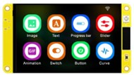          | La placa de desarrollo ESP32 LVGL cuenta con una pantalla LCD táctil de 2.8 pulgadas y una resolución de 320×240 píxeles. Además, tiene conectividad WiFi y Bluetooth, lo que la hace ideal para proyectos de Robótica, IoT y Domótica.                                                                                                                                                                                                                                                                   | 1        |
| Sensor Ltr390-uv      | 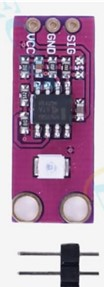    | El sensor Ltr390-uv es de bajo consumo con gran estabilidad y sensibilidad, con un ángulo de visión de hasta 130 grados. Es de ultra bajo consumo de aproximadamente 1 mA. Ideal para proyectos de monitoreo de luz UV.                                                                                                                                                                                                                                                                                 | 1        |
| Sensor BMP280         |        | El módulo BMP280 de presión atmosférica se utiliza para medir la presión barométrica, temperatura y la humedad relativa. Además, todo está integrado en un solo chip piezo-resistivo realmente compacto y de bajo consumo energético.                                                                                                                                                                                                                                                                    | 1        |
| Sensor CCS811, EN160+ATH21 | 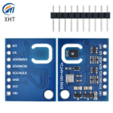 | Es un sensor multigas digital especialmente diseñado para el monitoreo de la calidad del aire interior. Puede detectar mejor una variedad de gases y compuestos orgánicos volátiles (COV), incluyendo tolueno, hidrógeno, etanol, NO2 y ozono.                                                                                                                                                                                                                                                             | 1        |
| Zumbador buzzer KY-006 | 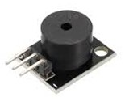 | El Zumbador Buzzer Pasivo Módulo KY-006 es un sensor piezoeléctrico el cual puede reproducir tonos de sonido entre un rango de 1.5Hz a 2.5 kHz dependiendo de la frecuencia de entrada, ya sea mediante retardos o modulación de ancho de pulso.                                                                                                                                                                                                                                                         | 1        |
| ESP32                 | 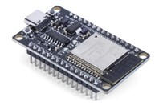               | El ESP32 emplea un microprocesador Tensilica Xtensa LX6 en sus variantes de simple y doble núcleo e incluye interruptores de antena, balun de radiofrecuencia, amplificador de potencia, amplificador receptor de bajo ruido, filtros, y módulos de administración de energía.                                                                                                                                                                                                                           | 1        |
| Leds                  | 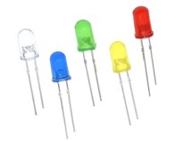                | Dispositivo que permite el paso de corriente en un solo sentido y que al ser polarizado emite un haz de luz.                                                                                                                                                                                                                                                                                                                                                                                             | 2        |
## Historias de usuario épicas
Descripción: Como usuario, quiero que la pulsera mida y muestre la temperatura y humedad ambiental para estar al tanto de las condiciones ambientales y tomar decisiones informadas.

1. **Medición de temperatura y humedad ambiental**
Descripción: Como desarrollador, quiero integrar un sensor de temperatura y humedad en la pulsera para medir las condiciones ambientales.
   **Criterios de aceptación:
	   - El sensor de temperatura y humedad debe estar conectado a la ESP32.
	   - Debe poder leer y enviar datos de temperatura y humedad al microcontrolador.

2. **Monitoreo de la calidad del aire**
Descripción: Como usuario, quiero que la pulsera procese y muestre los datos de temperatura y humedad en tiempo real.
   **Criterios de aceptación:
     - Los datos de temperatura y humedad deben ser procesados y actualizados cada minuto.
	  - La pantalla de la pulsera debe mostrar la temperatura y humedad actuales.
 

3. **Detección de rayos UV y alertas de protección solar**
   - Como usuario, quiero que la pulsera mida los niveles de radiación UV y me avise cuando sea necesario aplicar protector solar o buscar sombra para prevenir daños en la piel.

## Prototipo propuesto

**Dashboard prototipo**
Monitor de control
Se presenta una propuesta para el manejo y control de cada uno de los actuadores que dispone la pulsera UV, la finalidad es que el usuario no se complique con una interfaz difícil de manejar y pueda acceder a este control y rápido accionar al dispositivo.
Se maneja una estructura de 3 botones, los cuales son independientes en cada actuador, con el punto de poder encender y apagar dicho emisor.

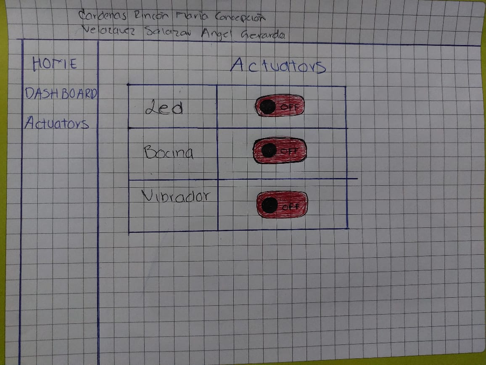

**Graficas de información**
La siguiente propuesta dispone de la visualización en formato de graficas con la información en tiempo real de todos los sensores que estan siendo manipulados en su pulsera UV, para poder mantener al usuario informado de su rango de datos y riesgos precisos según lo marcado. Se presentan las gráficas de temperatura, humedad y calidad del aire.

Esta última propuesta muestra a segunda parte de las graficas en donde se visualiza los rayos UV y la presión atmosférica. 

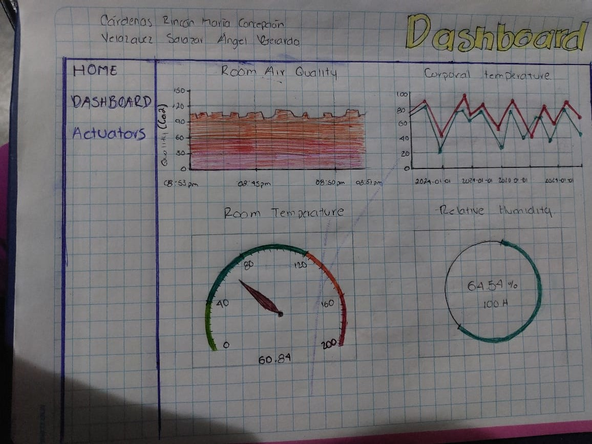

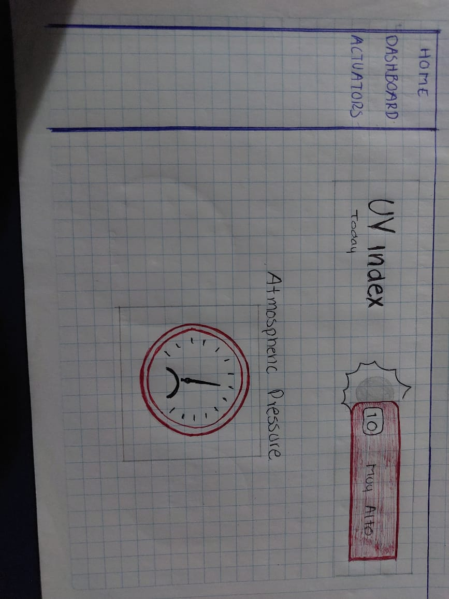

**Wearable prototipo**

**Funcionalidades del prototipo**
1. **Medición y monitoreo en tiempo real**
	- Los sensores integrados miden continuamente la temperatura y humedad ambiental, la temperatura corporal, la calidad del aire y los niveles de radiación UV.
	- Los datos son procesados y mostrados en la pantalla OLED de la pulsera.
2. **Alertas y notificaciones**
	- El zumbador buzzer emite un sonido y los LEDs cambian de color para alertar al usuario cuando se detectan niveles peligrosos.

**Beneficios**

Monitoreo de salud personal: Ayuda a los usuarios a mantenerse informados sobre su salud y las condiciones ambientales, permitiéndoles tomar medidas preventivas.
- Prevención de enfermedades: Alerta al usuario sobre niveles peligrosos de radiación UV y calidad del aire, ayudando a prevenir enfermedades relacionadas con la exposición a estos factores.
- Uso diario y deportivo: Ideal para personas que pasan mucho tiempo al aire libre, deportistas y aquellos que desean monitorear su salud en tiempo real.

## Arquitectura del proyecto

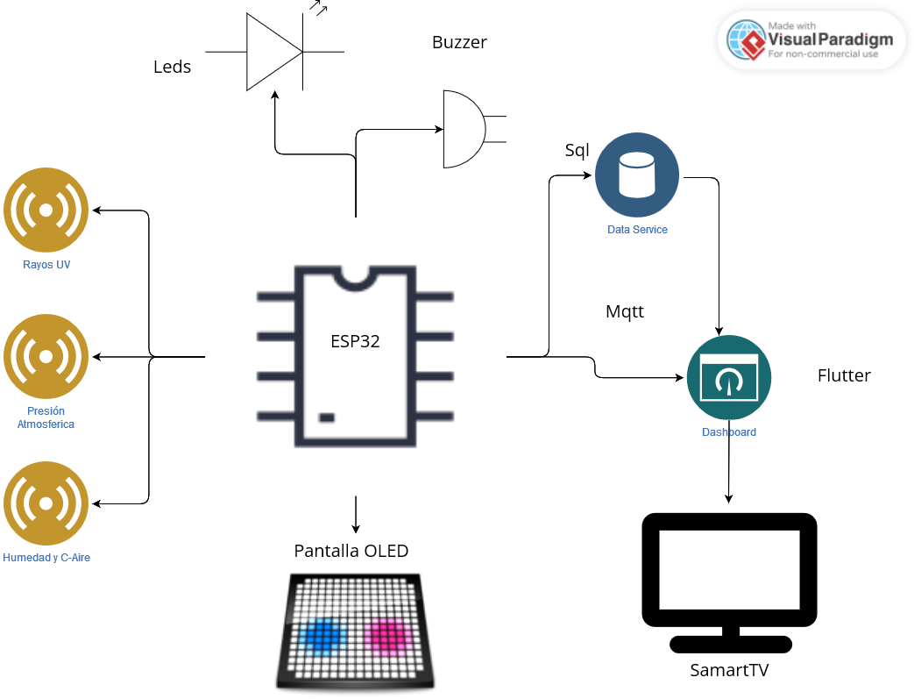

La arquitectura propuesta se basa en los siguientes elementos:

***Pulsera***

1. **Sensores**
   - Ltr390-uv: Sensor de rayos UV.
   - BMP280: Sensor de humedad, temperatura ambiental y presión atmosférica.
   - CCS811, EN160+ATH21: Sensor de calidad del aire.
     
3. **Controlador**
   - ESP32 LVGL: Placa de desarrollo con pantalla LCD para procesar y visualizar los datos de los sensores.
     
5. **Almacenamiento**
   - SQLite: Base de datos integrada para almacenar los datos de los sensores.
     
7. **Comunicación**
   - HTTP: Protocolo para enviar los datos a Node-RED.
   - MQTT: Protocolo para la comunicación con el broker MQTT.
   - Cifrado SSL/TLS: Para asegurar la comunicación y proteger los datos.

9. **Energía**
   - Batería: Fuente de alimentación para la pulsera.
   - Gestión de energía: Para optimizar el consumo y prolongar la duración de la batería.

***Node-Red***
1.  Procesamiento: Recibe los datos de la pulsera y realiza el procesamiento necesario.
2.  Visualización: Permite visualizar los datos en un dashboard o interfaz de usuario.

***Broker MQTT***
1. Actúa como intermediario para la comunicación entre la pulsera y los dispositivos receptores.

***Dispositivos receptores***
1. Panel de control: Proporciona una interfaz para monitorear y controlar el sistema.

## Tablero Kanban

Tablero de las tareas que deben realizar, al igual que las ya realizadas, mostrando a detalle en cada una con una descripción de lo que se debe hacer y su asignación.
Se trabajará con la herramienta Jira para fines de mejorar el control de actividades. 

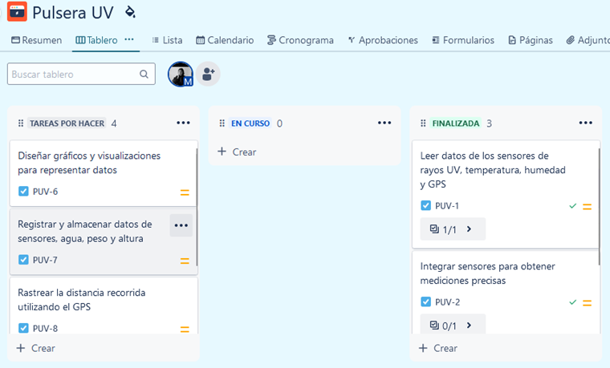

Lista de tareas definidas por el momento

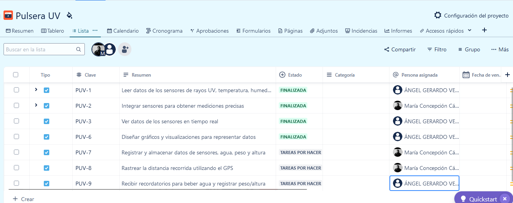

## Circuito diseñado

El circuito muestra el funcionamiento del actuador buzzer, en donde se mide la temperatura y la humedad del ambiente con un sensor DHT22.

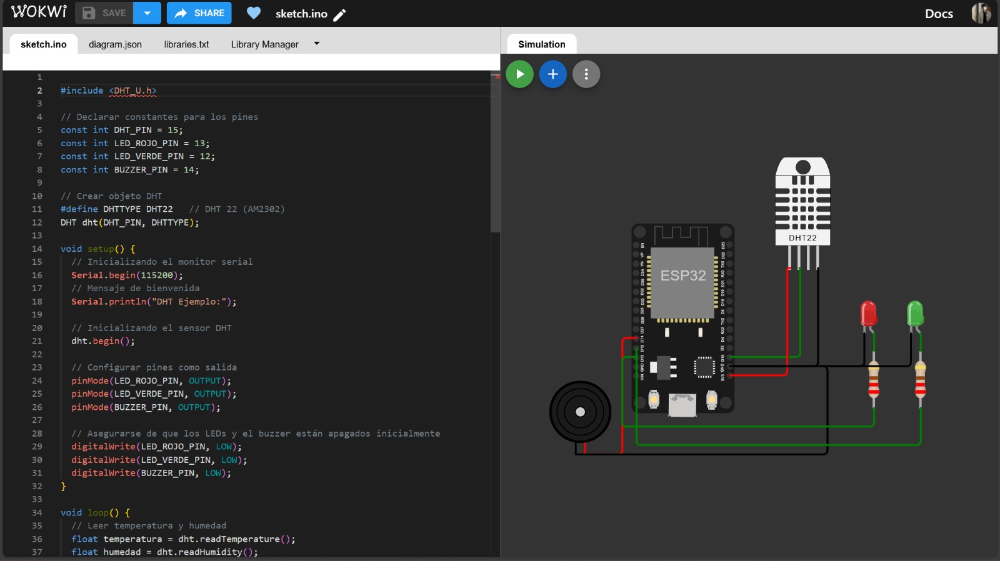

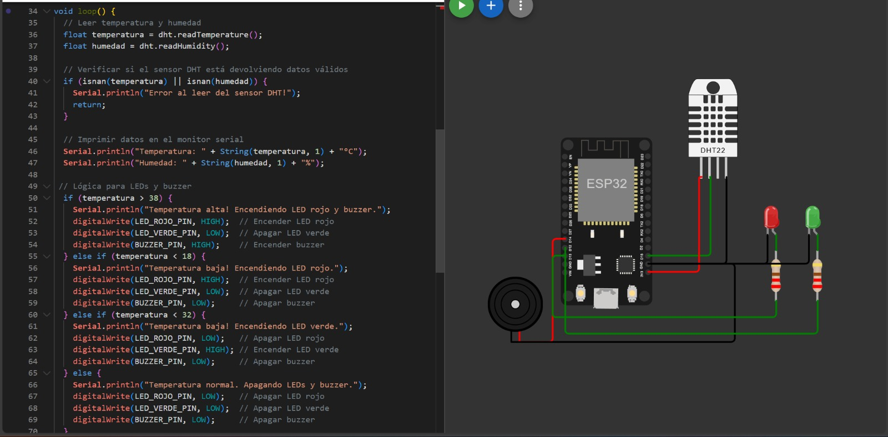

## Resultados

Primera prueba de funcionamiento con la indicación del niveles de humedad y temperatura altos, se debe encender el led color rojo y hacer sonar el buzzer.

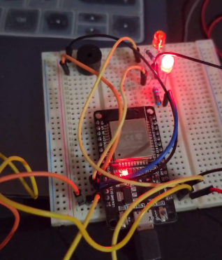

## Competencia en el mercado

**Replior – Trial On line**
En colaboración con SunSense
Replior se está asociando con Sunsense, de base noruega, que es un proveedor líder mundial de tecnología de sensores UV usables, para proporcionar al ensayo clínico adaptado al sensor UV con integración directa en la plataforma de captura de datos Trial Online.

***Especificación técnica: ***
- Dimensiones: 24,3mm de diámetro, 8,3 mm
- Carcasa de aluminio anodizado (costomizable)
- Dómetro de luz con sensor UVA-UVB ponderado erio con difusor optimizado por el wearable
- Salida promedio real de 2 minutos de UVI, UVA/UVB, R, G y B
- Medición del espectro personalizable
- Bluetooth Comunicación de baja energía. Rango: 5-10m
- Respuesta angular: 90 grados
- Batería, más de 300 días de operación continua
- Prueba de Splash
- Soluciones de desgaste flexibles con pulsera, clip y opciones sin cuello
- La superficie lisa, fácil de limpiar previene la grasa y la acumulación de sucisión que podría afectar la precisión del sensor.
 

**Banda Huawei Color Band A1**
Especificación técnica: 
•	Las pulseras Honor Band A1 están formadas por una sujeción que puede ser de goma o de piel y de un sensor metálico que ha recibido la certificación IP57, que se recopila los datos y los transmite a otro soporte a través de conexión bluetooth 4.2. No posee ni pantalla, pero sí un LED y vibración para comunicarse con el usuario cuando su smartphone recibe notificaciones de llamadas, mensajes u otros contenidos que decida configurar.
•	Permite la medición del ejercicio (pasos, velocidad y calorías consumidas) y del sueño. Sin embargo, sí incluye un sensor con el que no cuenta la Mi Band, el sensor de rayos ultravioleta, un elemento cada vez más extendido entre los móviles chinos dada la prioridad que da el mercado chino a la protección contra el sol.
•	La batería de esta pulsera deportiva es de 70 mAh y, según Huawei, eso es suficiente para que esté despierta durante 28 días. Después es necesario volver a recargar el sensor, algo que se hace mediante su puerto micro USB. El peso total es de 20 gramos.

