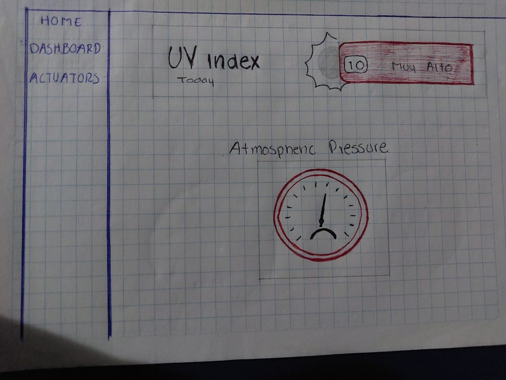

# Pulsera UV 

## Visión

La pulsera UV es un dispositivo wearable innovador diseñado para deportistas y mujeres que buscan proteger su piel de los dañinos rayos UV. Con sensores integrados y una dashboard complementario. Destinada a proporcionar datos precisos sobre la exposición a los rayos UV, presión atmosférica, calidad del aire y medición de temperatura y humedad en el ambiente, con la finalidad de mitigar los riesgos de cáncer de piel. Su diseño elegante, y batería de larga duración lo convierten en el compañero perfecto para actividades al aire libre. Destina se diferencia de la competencia al ofrecer una solución específica y accesible para aquellos que priorizan la salud de su piel.

## Software empleado

| Nombre                | Licencia                                                                                        |
|-----------------------|-------------------------------------------------------------------------------------------------|
| SQLite                | Public Domain                                                                                   |
| Adafruit_Sensor       | Apache License 2.0                                                                              |
| Adafruit_BME280       | BSD License                                                                                     |
| Adafruit_ADXL345      | BSD License                                                                                     |
| Adafruit_CCS811       | Apache License 2.0                                                                              |
| Adafruit_AHTX0        | BSD License                                                                                     |
| Flutter		| Version 3.24.1 - Dart 3.5.1									  |
| Android Studio	| Version 2024.1.1 SHA-256									  |

## Hardware empleado

| Nombre                | Imagen                                    | Descripción                                                                                                                                                                                                                                                                                                                                                                                                                                                                                             | Cantidad |
|-----------------------|-------------------------------------------|---------------------------------------------------------------------------------------------------------------------------------------------------------------------------------------------------------------------------------------------------------------------------------------------------------------------------------------------------------------------------------------------------------------------------------------------------------------------------------------------------------|----------|
| Smart TV - escolar           |           | La pantalla de una televisión de 32″ tiene una diagonal de 81 cm. con una alto de 39,8 cm. y un ancho de 70,8 cm. Los televisores de 32 pulgadas son una opción popular por su versatilidad y tamaño compacto.                                                                                                                                                                                                                                                                   | 1        |
| Sensor Ltr390-uv      |     | El sensor Ltr390-uv es de bajo consumo con gran estabilidad y sensibilidad, con un ángulo de visión de hasta 130 grados. Es de ultra bajo consumo de aproximadamente 1 mA. Ideal para proyectos de monitoreo de luz UV.                                                                                                                                                                                                                                                                                 | 1        |
| Sensor BMP280         |        | El módulo BMP280 de presión atmosférica se utiliza para medir la presión barométrica, temperatura y la humedad relativa. Además, todo está integrado en un solo chip piezo-resistivo realmente compacto y de bajo consumo energético.                                                                                                                                                                                                                                                                    | 1        |
| Sensor CCS811, EN160+ATH21 |  | Es un sensor multigas digital especialmente diseñado para el monitoreo de la calidad del aire interior. Puede detectar mejor una variedad de gases y compuestos orgánicos volátiles (COV), incluyendo tolueno, hidrógeno, etanol, NO2 y ozono.                                                                                                                                                                                                                                                             | 1        |
| Zumbador buzzer KY-006 |  | El Zumbador Buzzer Pasivo Módulo KY-006 es un sensor piezoeléctrico el cual puede reproducir tonos de sonido entre un rango de 1.5Hz a 2.5 kHz dependiendo de la frecuencia de entrada, ya sea mediante retardos o modulación de ancho de pulso.                                                                                                                                                                                                                                                         | 1        |
| ESP32                 |                | El ESP32 emplea un microprocesador Tensilica Xtensa LX6 en sus variantes de simple y doble núcleo e incluye interruptores de antena, balun de radiofrecuencia, amplificador de potencia, amplificador receptor de bajo ruido, filtros, y módulos de administración de energía.                                                                                                                                                                                                                           | 1        |
| Leds                  |                 | Dispositivo que permite el paso de corriente en un solo sentido y que al ser polarizado emite un haz de luz.                                                                                                                                                                                                                                                                                                                                                                                          | 3        |
| Buzzer                  |                 | Un zumbador (en inglés buzzer) es un transductor electroacústico que produce un sonido o zumbido continuo o intermitente de un mismo tono (generalmente agudo).                                                                                                                                                                                                                                                                                                                                                                             | 1        |
| Boton                  |                 | Dispositivo que permite el paso de corriente en un solo sentido y que al ser polarizado emite un haz de luz.                                                                                                                                                                                                                                                                                 | 1        |
| Funda deportiva                  |                 | Dispositivo que permite el paso de corriente en un solo sentido y que al ser polarizado emite un haz de luz.                                                                                                                                                                                                                                                                                                                                                                                             | 2        |

## Historias de usuario 
### Lectura de datos de los sensores

**Historia de usuario:**  
Como desarrollador, quiero poder leer los datos de los sensores de rayos UV, temperatura, humedad, presión atmosférica y calidad de aire, para poder obtener mediciones precisas en tiempo real y utilizarlas en mi aplicación.

**Criterios de aceptación:**
- Los sensores están conectados y configurados correctamente para transmitir datos.
- Los datos se obtienen y procesan en tiempo real.

### Integración de sensores para mediciones precisas

**Historia de usuario:**  
Como desarrollador, quiero integrar sensores de rayos UV, temperatura, humedad, presión atmosférica y calidad de aire en mi sistema, para asegurarme de que las mediciones que obtengo son precisas y fiables.

**Criterios de aceptación:**
- Los sensores están calibrados y proporcionan datos dentro de un rango aceptable de precisión.
- Los sensores están integrados en la aplicación de manera que los datos se actualizan continuamente.

### Visualización en tiempo real en una app de Flutter

**Historia de usuario:**  
Como usuario, quiero ver los datos de los sensores en tiempo real en una aplicación de Flutter, para poder monitorear las condiciones ambientales de manera inmediata desde mi dispositivo móvil.

**Criterios de aceptación:**
- La aplicación de Flutter muestra los datos en tiempo real sin retraso significativo.
- La interfaz es clara y fácil de entender para monitorear todos los datos importantes.

### Diseño de gráficos y visualizaciones

**Historia de usuario:**  
Como usuario, quiero ver gráficos y visualizaciones de los datos obtenidos por los sensores, para comprender mejor las tendencias y patrones en las mediciones.

**Criterios de aceptación:**
- La aplicación muestra gráficos que representan los datos de manera clara y efectiva.
- Los gráficos se actualizan en tiempo real con los nuevos datos de los sensores.

### Registro y almacenamiento de datos de sensores

**Historia de usuario:**  
Como desarrollador, quiero registrar y almacenar los datos de los sensores de presión atmosférica, UV, humedad, y calidad de aire, para poder analizar las tendencias a largo plazo y realizar revisiones históricas de las condiciones.

**Criterios de aceptación:**
- Los datos se almacenan de manera segura y están disponibles para su análisis posterior.
- El sistema permite acceder a datos históricos con facilidad.

### Activación de LED y buzzer por alta temperatura

**Historia de usuario:**  
Como usuario, quiero que se activen un LED y un buzzer cuando la temperatura alcance un nivel muy alto, para que pueda recibir una alerta inmediata sobre condiciones peligrosas.

**Criterios de aceptación:**
- El sistema monitorea continuamente la temperatura.
- El LED y el buzzer se activan automáticamente cuando la temperatura supera un umbral predefinido.

### Visualización de datos y gráficos en pantalla OLED

**Historia de usuario:**  
Como usuario, quiero ver los datos de los sensores y sus gráficas correspondientes en una pantalla OLED, para poder monitorear las condiciones directamente desde el dispositivo sin necesidad de una aplicación externa.

**Criterios de aceptación:**
- La pantalla OLED muestra los datos de manera clara y fácil de leer.
- Las gráficas en la pantalla OLED se actualizan en tiempo real con los datos obtenidos por los sensores.

## Prototipo propuesto

**Dashboard prototipo**
Monitor de control
Se presenta una propuesta para el manejo y control de cada uno de los actuadores que dispone la pulsera UV, la finalidad es que el usuario no se complique con una interfaz difícil de manejar y pueda acceder a este control y rápido accionar al dispositivo.
Se maneja una estructura de 1 botón, el cual permite manejar el actuador de forma que pueda encender y apagar dicho emisor.

**Graficas de información**
La siguiente propuesta dispone de la visualización en formato de graficas con la información en tiempo real de todos los sensores que estan siendo manipulados en su pulsera UV, para poder mantener al usuario informado de su rango de datos y riesgos precisos según lo marcado. Se presentan las gráficas de temperatura, humedad y calidad del aire.

Esta última propuesta muestra a segunda parte de las graficas en donde se visualiza los rayos UV y la presión atmosférica. 

## Resultado de Dashboard
Muestra las graficas de control de cada uno de los sesnores que se manejan, mostrando de una forma visual los resultados que identifican en tiempo real.

**Wearable prototipo**

**Funcionalidades del prototipo**
1. **Medición y monitoreo en tiempo real**
	- Los sensores integrados miden continuamente la temperatura y humedad ambiental, la temperatura corporal, la calidad del aire y los niveles de radiación UV.
	- Los datos son procesados y mostrados en la pantalla OLED de la pulsera.
2. **Alertas y notificaciones**
	- El zumbador buzzer emite un sonido y los LEDs cambian de color para alertar al usuario cuando se detectan niveles peligrosos.

**Beneficios**

Monitoreo de salud personal: Ayuda a los usuarios a mantenerse informados sobre su salud y las condiciones ambientales, permitiéndoles tomar medidas preventivas.
- Prevención de enfermedades: Alerta al usuario sobre niveles peligrosos de radiación UV y calidad del aire, ayudando a prevenir enfermedades relacionadas con la exposición a estos factores.
- Uso diario y deportivo: Ideal para personas que pasan mucho tiempo al aire libre, deportistas y aquellos que desean monitorear su salud en tiempo real.

## Arquitectura del proyecto

La arquitectura propuesta se basa en los siguientes elementos:

***Pulsera***

1. **Sensores**
   - Ltr390-uv: Sensor de rayos UV.
   - BMP280: Sensor de humedad, temperatura ambiental y presión atmosférica.
   - CCS811, EN160+ATH21: Sensor de calidad del aire.
     
2. **Almacenamiento**
   - SQLite: Base de datos integrada para almacenar los datos de los sensores.
     
3. **Comunicación**
   - Servidor (ESP32): Define endpoints (rutas URL) para manejar solicitudes GET y POST. Escucha y responde a las solicitudes entrantes con datos o realiza acciones basadas en la solicitud
   - Cliente (Flutter): Envía solicitudes GET para obtener datos del ESP32. Envía solicitudes POST para enviar datos o comandos al ESP32. Recibe y maneja las respuestas del ESP32, actualizando la interfaz de usuario según sea necesario.
     
4. **Energía**
   - Batería: Fuente de alimentación para la pulsera.
   - Gestión de energía: Para optimizar el consumo y prolongar la duración de la batería.

***Dispositivos receptores***
1. Panel de control: Proporciona una interfaz para monitorear y controlar el sistema.

## Tablero Kanban

Tablero de las tareas que deben realizar, al igual que las ya realizadas, mostrando a detalle en cada una con una descripción de lo que se debe hacer y su asignación.
Se trabajará con la herramienta Jira para fines de mejorar el control de actividades. 

Lista de tareas definidas por el momento

**Actividades culminadas**

## Circuito diseñado

El circuito muestra el funcionamiento del actuador buzzer, en donde se mide la temperatura y la humedad del ambiente con un sensor DHT22.

## Resultados

Resultado del circuito completado para el prototipo, usando ESP32, integrando todos los sensores y actuadores.

## Competencia en el mercado

**Replior – Trial On line**
En colaboración con SunSense
Replior se está asociando con Sunsense, de base noruega, que es un proveedor líder mundial de tecnología de sensores UV usables, para proporcionar al ensayo clínico adaptado al sensor UV con integración directa en la plataforma de captura de datos Trial Online.

***Especificación técnica: ***
- Dimensiones: 24,3mm de diámetro, 8,3 mm
- Carcasa de aluminio anodizado (costomizable)
- Dómetro de luz con sensor UVA-UVB ponderado erio con difusor optimizado por el wearable
- Salida promedio real de 2 minutos de UVI, UVA/UVB, R, G y B
- Medición del espectro personalizable
- Bluetooth Comunicación de baja energía. Rango: 5-10m
- Respuesta angular: 90 grados
- Batería, más de 300 días de operación continua
- Prueba de Splash
- Soluciones de desgaste flexibles con pulsera, clip y opciones sin cuello
- La superficie lisa, fácil de limpiar previene la grasa y la acumulación de sucisión que podría afectar la precisión del sensor.
 

**Banda Huawei Color Band A1**
Especificación técnica: 
•	Las pulseras Honor Band A1 están formadas por una sujeción que puede ser de goma o de piel y de un sensor metálico que ha recibido la certificación IP57, que se recopila los datos y los transmite a otro soporte a través de conexión bluetooth 4.2. No posee ni pantalla, pero sí un LED y vibración para comunicarse con el usuario cuando su smartphone recibe notificaciones de llamadas, mensajes u otros contenidos que decida configurar.
•	Permite la medición del ejercicio (pasos, velocidad y calorías consumidas) y del sueño. Sin embargo, sí incluye un sensor con el que no cuenta la Mi Band, el sensor de rayos ultravioleta, un elemento cada vez más extendido entre los móviles chinos dada la prioridad que da el mercado chino a la protección contra el sol.
•	La batería de esta pulsera deportiva es de 70 mAh y, según Huawei, eso es suficiente para que esté despierta durante 28 días. Después es necesario volver a recargar el sensor, algo que se hace mediante su puerto micro USB. El peso total es de 20 gramos.

